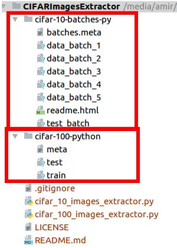

In the name of God

# CIFAR Images Extractor
This repository extracts [CIFAR](https://www.cs.toronto.edu/~kriz/cifar.html) dataset images.

# Extract images

## Download the datasets
Before extracting the dataset images, you should download the following datasets:

* Download CIFAR-10: https://www.cs.toronto.edu/~kriz/cifar-10-python.tar.gz
* Download CIFAR-100: https://www.cs.toronto.edu/~kriz/cifar-100-python.tar.gz

Extract both above files, then your folder structure should be like the following image:



## Extract CIFAR-10 images
To extract **CIFAR-10** dataset images, type the following command at the command prompt:
```
python3 ./cifar_10_images_extractor.py
```

## Extract CIFAR-100 images
To extract **CIFAR-100** dataset images, type the following command at the command prompt:
```
python3 ./cifar_100_images_extractor.py
```

# Dependencies
* Python 3
* scipy

# Links
* https://www.cs.toronto.edu/~kriz/cifar.html
* https://github.com/amir-saniyan/CIFARImagesExtractor
